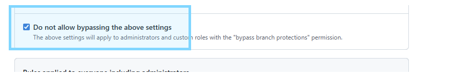

# Setup GitHub Settings

- **Set repo visibility** via `General > Danger Zone`


- **Add collaborators**
    - Only collaborators could be commit changes
    - **Personal repo**
        | Role                 | Can push | Approve/Merge* | Manage repo settings |
        |----------------------|----------|----------------|----------------------|
        | Owner                | Yes      | Yes            | Yes                  |
        | Collaborator (Write) | Yes      | Yes            | No                   |

    - **Organization repo**
        | Role                      | Can push | Approve/Merge* | Manage issues/PRs | Manage repo settings                 |
        |---------------------------|----------|----------------|-------------------|--------------------------------------|
        | Org Owner (org-level)     | Yes      | Yes            | Yes               | Yes (org + all repos)                |
        | Admin (repo)              | Yes      | Yes            | Yes               | Yes                                  |
        | Maintain                  | Yes      | Yes            | Yes               | Most (not delete/transfer)           |
        | Write                     | Yes      | Yes            | Yes               | No                                   |
        | Triage                    | No       | No             | Yes               | No                                   |
        | Read                      | No       | No             | No                | No                                   |


- **Branch protection rule**




- **Setup `CODEOWNERS` file** in `.github` folder
```
* @weyseing
/src @weyseing
```